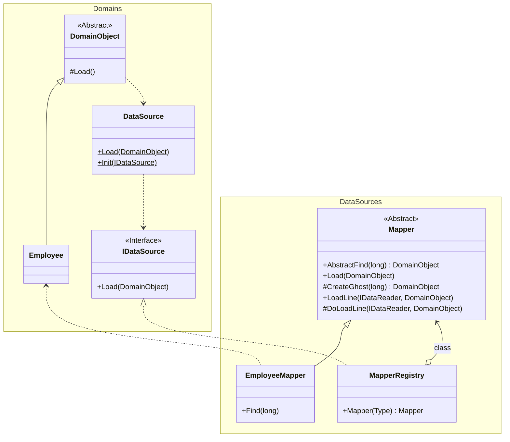
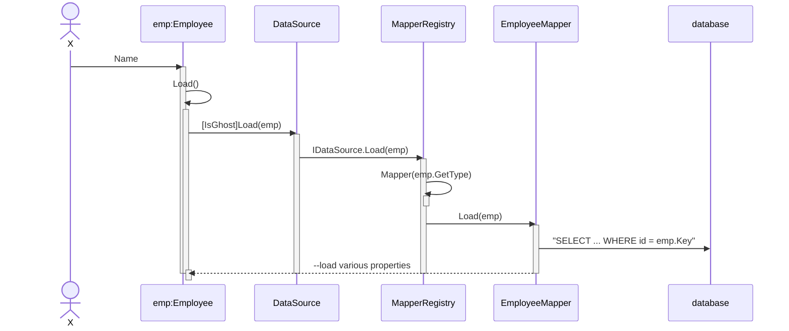
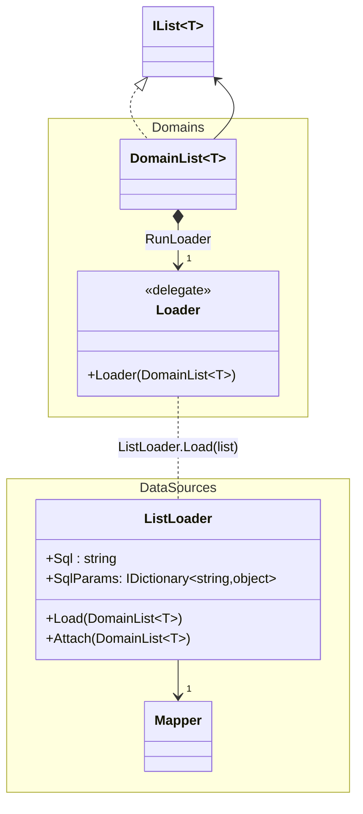

# Lazy Load

An object that doesn't contain all of the data you need but knows how to get it.

## Table of Contents <!-- omit in toc -->

## Lazy Initialization

Lazy Initialization is the most direct way to implement **lazy loading within the object itself**.

Inside the getter method for a field (e.g., `getOrders()` in a Customer object), it checks if that field has been initialized (i.e., if it is `null`). If it is `null`, it queries the database at that moment to retrieve the data, sets it to the field, and then returns the value. On subsequent calls, the data is already present in the field, so no database query is made.

- Pros
  - The implementation is simple and intuitive.
  - Easy to introduce as it doesn't require a special framework.
- Cons
  - The object itself contains the data-fetching logic (e.g., SQL queries), which creates a strong dependency between the object and the data source (database). This can harm code reusability and testability.
  - Similar `null`-checking logic must be written for every field that requires lazy loading.

## Virtual Proxy

Virtual Proxy is an approach that **uses a stand-in" (a proxy) for the real object**.

From the client's perspective, the proxy object looks exactly like the real object (it has the same interface and methods). However, this proxy does not initially contain the real data.
When a client calls any of the proxy's methods for the first time, the proxy secretly loads the real object from the database and delegates the method call to it.

- Pros
  - It separates the lazy-loading logic from the domain object into the proxy. This keeps the domain object's responsibilities clean.
  - The client doesn't need to know whether it's interacting with the real object or the proxy.
- Cons
  - It can lead to "identity" issues. The proxy object and the real object loaded later are two different instances in memory. This can cause unexpected results when comparing objects for identity (e.g., with `==`).
  - It may require a framework or library to dynamically generate proxies.

## Value Holder

A Value Holder is a technique that **uses a generic object to encapsulate the data-loading logic**.

Instead of holding the actual data (e.g., a list of `Order` objects), a field in an object holds a Value Holder object. This Value Holder knows how to fetch the data.
When the actual data is needed, the object asks the Value Holder to `getValue()`. On the first request, the Value Holder queries the database, loads the data, stores it internally, and returns it.

- Pros
  - The data-loading logic is completely separated into a reusable Value Holder class. This frees the domain object from being aware of the data source.
  - It is very flexible and the same mechanism can be applied to many different objects.
- Cons
  - The code becomes slightly more indirect, as the client must get the value through the Value Holder instead of directly from the field.

## Ghost object

A Ghost is an approach where **an object is first created in a "hollow" state, containing only its ID**.

When an object is loaded from the database, it is first instantiated in a partial (incomplete) state with only its ID populated. This is the "Ghost." At this point, memory consumption is minimal.
Later, when the application accesses any field other than the ID (e.g., name, date) for the first time, that access triggers a full load from the database. The object then populates all of its own fields, turning into a "real," fully-loaded object.

- Pros
  - Since the object instance exists from the beginning, it avoids the identity issues seen with Virtual Proxy.
  - It allows you to set up associations between objects using their ghost references before they are fully loaded.
- Cons
  - The implementation can be complex, as it requires a mechanism to track the state of the object (ghost or fully loaded).
  - The object itself needs to contain the logic for loading its full state from the database based on its current state.

### 11.3.6 Use Ghost

> For loading to work, the domain object needs to call the appropriate mapper, but in my experience, the domain code may not know about the mapper object. To avoid dependencies on specific objects, I use a combination of a registry and separate interfaces.

Classes involved in Ghost loading:

Ghost Loading Sequence:

> Collections are the most complex case: to avoid reloading, it is important to load all TimeRecords in one query, which requires a special list implementation that acts as a ghost list.

Ghost List Classes:

